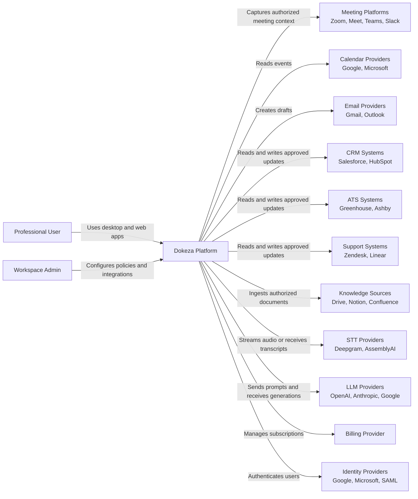
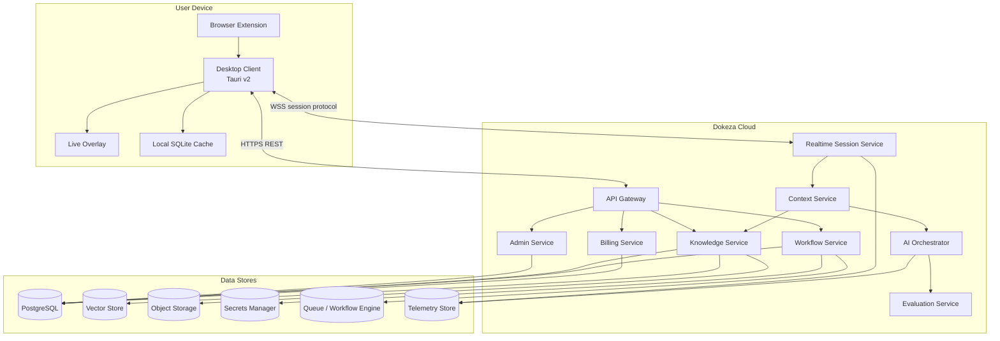
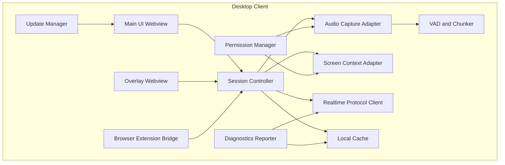
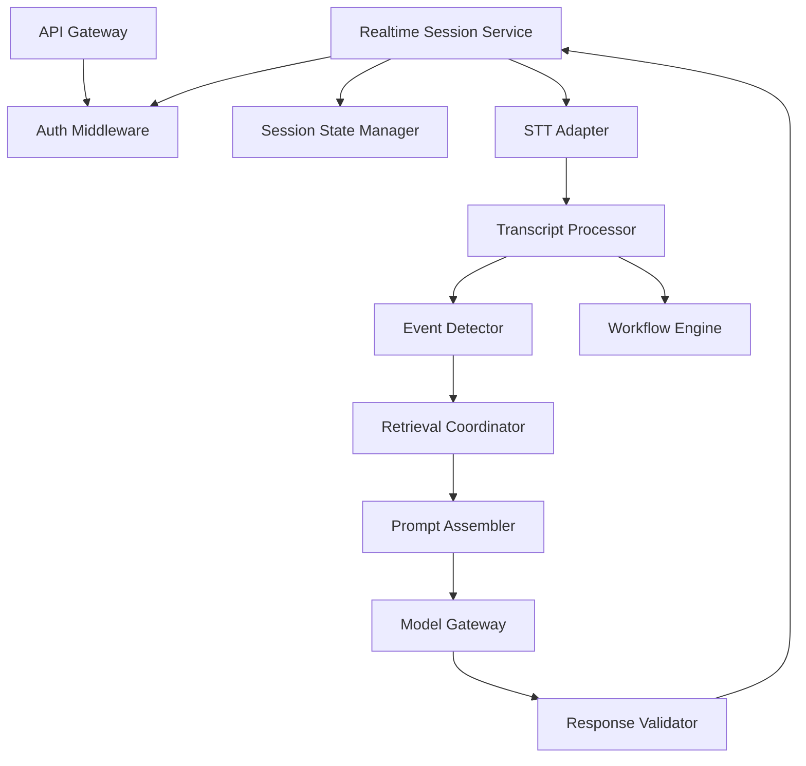

# Dokeza C4 Architecture

## 1. Purpose

This document defines Dokeza's architecture boundaries using a C4-style model. It is intended to remove ambiguity between desktop, backend, AI, integrations, and security workstreams.

## 2. Level 1: System Context

## 3. Level 2: Containers

## 4. Level 3: Desktop Components

### 4.1 Desktop Process Boundaries

| Component | Recommended Boundary | Notes |
| --- | --- | --- |
| Main UI | Webview renderer | Onboarding, settings, meeting review. |
| Overlay UI | Separate webview/window | Must stay responsive during capture and transcription. |
| Audio capture | Native thread or sidecar | Avoid blocking UI. Use platform APIs through Rust or native modules. |
| VAD/chunking | Native worker thread | Handles CPU-sensitive realtime processing. |
| Local STT | Optional sidecar process | Allows independent crash recovery and model lifecycle. |
| Realtime protocol | Native/backend process | Maintains WSS connection and buffering. |
| Diagnostics | Background worker | Redacts sensitive content by default. |

## 5. Level 3: Backend Components

## 6. Key Architecture Decisions

| Decision | Baseline |
| --- | --- |
| Desktop shell | Tauri v2, pending spike validation per `docs/architecture/adr/0001-desktop-shell-tauri-v2.md`. |
| Desktop-to-backend realtime transport | WebSocket over TLS. |
| Audio frame encoding | Binary frames for audio, JSON frames for control and events. |
| Backend runtime | TypeScript/Node.js for initial services, with generated JSON Schema contract artifacts. |
| Backend topology | Modular services behind an API gateway; monorepo acceptable initially. |
| Data store | Managed PostgreSQL for relational data, pgvector for initial embeddings, object storage for raw artifacts. |
| Workflow execution | Workflow service backed by a PostgreSQL job queue initially. |
| Provider abstraction | STT, embeddings, LLM, billing, and integrations must sit behind internal adapters. |
| Initial cloud STT provider | Deepgram through the backend STT adapter. |
| Initial LLM and embedding provider | OpenAI through the model gateway. |
| Workspace isolation | Enforced at every request and retrieval boundary. |
| Local-first readiness | Pipeline stages must declare cloud, local, or hybrid execution location. |
| Realtime STT routing | Desktop audio routes through the Dokeza realtime service before any cloud STT provider. |

## 7. Open Architecture Decisions

- Whether the Tauri v2 spike passes all accepted ADR criteria.
- When direct client-to-provider STT is worth reconsidering for enterprise policy exceptions.
- When vector isolation must move from pgvector shared tables to per-workspace collections or a dedicated vector store.
- Whether enterprise deployments require regional service stacks from the beginning.
