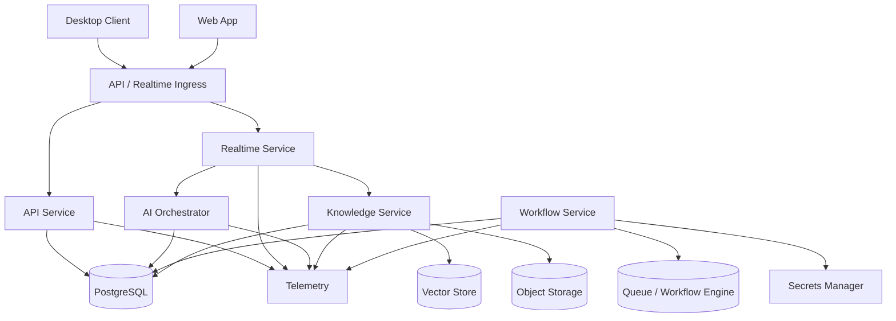

# Dokeza Infrastructure and DevOps Architecture

## 1. Purpose

This document defines Dokeza's infrastructure direction before implementation begins. It covers environments, cloud architecture, deployment, secrets, observability, reliability, and operational gates.

## 2. Infrastructure Principles

- Prefer managed services until scale or compliance requires ownership.
- Use infrastructure as code for every persistent cloud resource.
- Keep production, staging, and development isolated.
- Make every critical path observable before public release.
- Design for provider abstraction, not provider lock-in at the application boundary.
- Treat AI provider cost, latency, and error rate as production reliability concerns.

## 3. Environments

| Environment | Purpose | Data | Access |
| --- | --- | --- | --- |
| Local | Developer iteration | Synthetic only by default | Developer machine |
| CI | Automated validation | Synthetic fixtures | CI service |
| Preview | Short-lived branch validation | Synthetic or seeded demo data | Internal |
| Staging | Release candidate validation | Synthetic and approved test data | Internal and selected testers |
| Production | Customer workloads | Customer data | Least-privilege operations |

Production data must not be copied to lower environments without explicit approval, redaction, and audit.

## 4. Baseline Cloud Components

| Component | Baseline |
| --- | --- |
| Compute | Containerized services on managed container platform |
| Database | Managed PostgreSQL |
| Vector store | pgvector in managed PostgreSQL initially; Qdrant or managed vector DB only if scale requires |
| Object storage | S3-compatible object storage |
| Queue/workflows | PostgreSQL-backed job queue initially; Temporal or managed workflow engine if long-running workflows require it |
| Secrets | Cloud secrets manager |
| Realtime ingress | Load-balanced WebSocket-capable ingress |
| CDN | Static web app and downloads |
| Observability | OpenTelemetry traces, metrics, logs, crash reports |
| Billing | External billing provider |

Database credentials are split by duty:

- A deployment-only migration owner applies schema migrations and provisions/grants `dokeza_app`.
- Runtime services use a login role that may `SET ROLE dokeza_app`, or a login whose privileges are equivalent and no broader.
- Only a separately approved operations role may have `BYPASSRLS`; it is not available to application containers.
- Deployment configuration sets `DOKEZA_DATABASE_ROLE=dokeza_app`, and readiness must fail if that role cannot be selected.

## 5. Deployment Topology

## 6. Infrastructure as Code

Use Terraform as the default infrastructure definition.

Required modules:

- Network and ingress.
- Service runtime.
- PostgreSQL.
- Vector storage.
- Object storage.
- Queue/workflow engine.
- Secrets.
- Observability.
- IAM/service accounts.
- DNS and certificates.

Terraform state must be remote, encrypted, and access-controlled.

## 7. CI/CD

CI must run on every pull request:

- Format checks.
- Lint checks.
- Unit tests.
- Contract tests.
- Security and secret scanning.
- Dependency audit.
- Type checks.
- Desktop build smoke test when desktop code changes.
- Backend container build when service code changes.

Release pipelines must support:

- Staging deploy.
- Smoke tests.
- Manual production approval.
- Progressive rollout.
- Rollback.
- Artifact signing for desktop releases.

## 8. Desktop Release Operations

Desktop release must support:

- Stable and beta channels.
- Signed installers.
- Signed update manifests.
- Version pinning for enterprise customers.
- No update application during active meeting sessions.
- Rollback to previous known-good version.
- Crash-rate monitoring by version.

## 9. Observability

Required signals:

- Realtime session latency by stage.
- STT provider latency and error rate.
- LLM provider latency, error rate, token count, and cost.
- Retrieval latency and top-k result counts.
- WebSocket reconnects and backpressure events.
- Post-call job success and retry rates.
- Integration writeback failures.
- Desktop crash-free session rate.
- Retention and deletion job outcomes.

Logs must exclude raw transcript, prompt, document, and suggestion content by default.

### 9.1 Local Observability Baseline

The repository includes a local OpenTelemetry stack under `infra/observability`:

- OpenTelemetry Collector for OTLP ingest on ports `4317` and `4318`.
- Prometheus for local metrics at `http://localhost:9090`.
- Jaeger for local trace inspection at `http://localhost:16686`.
- Grafana for local dashboards at `http://localhost:3001`.

Start it with `pnpm observability:up` and validate the compose configuration with `pnpm observability:config`.

Local telemetry is for synthetic development data by default. Application code must emit redacted fields through the shared telemetry package and must not send raw transcript, prompt, document, suggestion, or audio content to the collector.

## 10. Reliability Targets

| Target | Internal Beta | Production | Enterprise |
| --- | ---: | ---: | ---: |
| Backend availability | 99.5% | 99.9% | 99.9%+ |
| Crash-free desktop sessions | 99.0% | 99.5% | 99.7% |
| P95 live suggestion latency | <4s | <3s | <3s |
| P95 STT partial latency | <1.5s | <1s | <1s |
| Post-call job success | 98% | 99% | 99% |

## 11. Disaster Recovery

Before commercial launch, define and test:

- Database backup schedule.
- Object storage recovery.
- Secrets recovery process.
- Region outage playbook.
- Provider outage fallback.
- Restore drill procedure.
- Recovery time objective.
- Recovery point objective.

## 12. Open Decisions

- Cloud provider.
- Managed container platform.
- When to move from pgvector to a dedicated vector database, based on measured latency, scale, and operational complexity.
- When to move from the PostgreSQL-backed job queue to Temporal or a managed workflow engine.
- Billing provider.
- Observability vendor.
- First production region.
- Whether enterprise data residency is required before launch.
