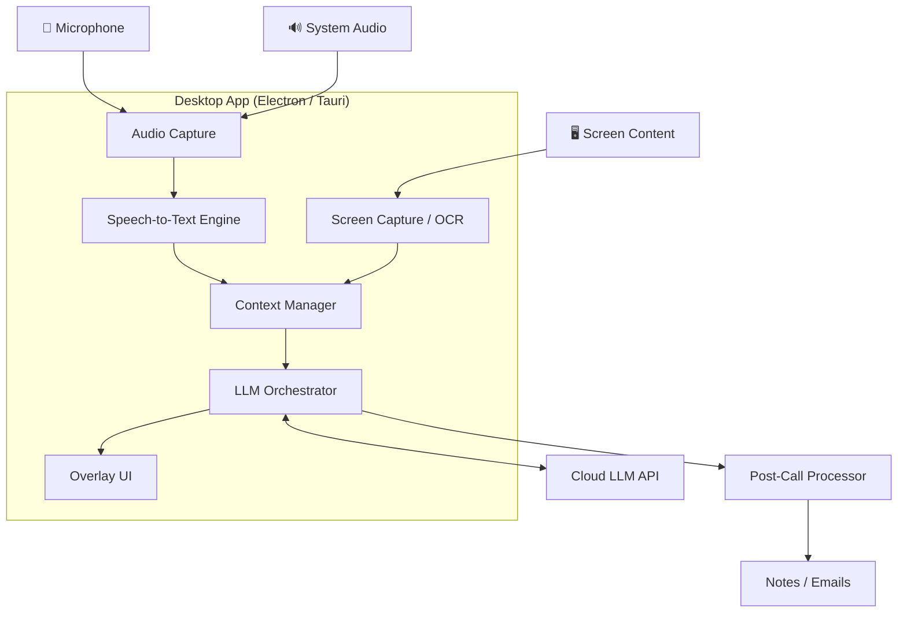
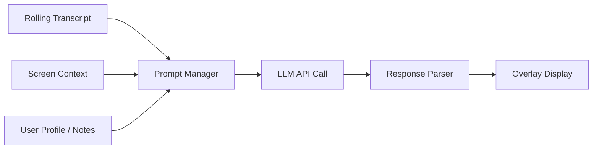
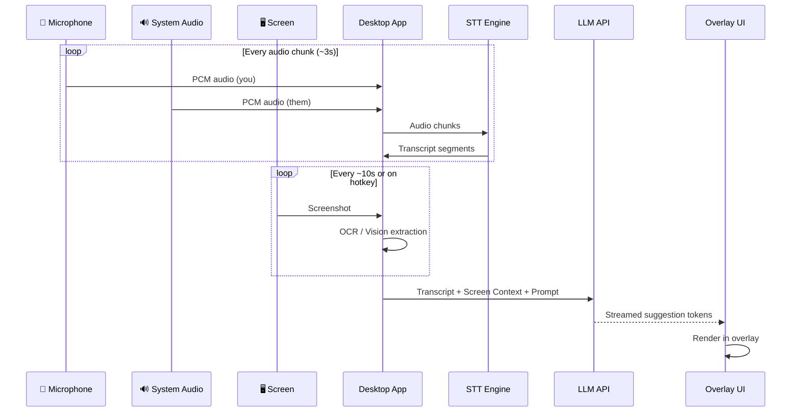

# Replicating Cluely — Software Engineering Breakdown

## High-Level Architecture



The app decomposes into **7 major subsystems**. Each is described below with technology choices, key challenges, and implementation notes.

---

## 1. Desktop Application Shell

**What it does:** Cross-platform container that hosts all subsystems, manages the app lifecycle, and provides OS-level access (audio devices, screen capture, window management).

**Technology choices:**

| Framework | Pros | Cons |
|-----------|------|------|
| **Electron** | Mature, huge ecosystem, easy UI with web tech | Heavy memory footprint (~150-300MB), larger bundle |
| **Tauri** | Lightweight (~10-30MB), Rust backend for performance | Younger ecosystem, WebView quirks across platforms |
| **Native (Swift + C++/WinAPI)** | Best performance, full OS control | Two codebases, much slower development |

> [!TIP]
> **Tauri v2** is the sweet spot — it gives you Rust for performance-critical audio/capture pipelines and web tech for UI, with a fraction of Electron's memory overhead. Cluely itself appears to use Electron based on public analysis.

**Key implementation details:**
- Use a **multi-window architecture**: main settings window + transparent overlay window
- Register **global hotkeys** via OS APIs (e.g., `GlobalShortcut` in Tauri, `globalShortcut` in Electron)
- Run audio processing in a **separate thread/process** to avoid UI jank
- Auto-updater for seamless updates (Tauri has built-in, Electron uses `electron-updater`)

---

## 2. Audio Capture Pipeline

**What it does:** Captures both microphone input (your voice) and system/loopback audio (the other participants' voices from the meeting app).

**How to implement:**

### Microphone Capture
Straightforward — use platform audio APIs:
- **Windows:** WASAPI via `cpal` (Rust) or `node-audiorecorder` (Node.js)
- **macOS:** CoreAudio via `cpal` or `AVAudioEngine`

### System Audio (Loopback) Capture — The Hard Part

This is capturing "what the speakers are playing" (i.e., the remote participants' audio from Zoom/Teams/Meet).

| Platform | Approach |
|----------|----------|
| **Windows** | WASAPI Loopback mode — well-supported, capture any audio output device |
| **macOS** | No native loopback API. Requires a **virtual audio driver** (e.g., BlackHole, Soundflower) or use of `ScreenCaptureKit` (macOS 13+) which can capture app audio |

> [!WARNING]
> macOS loopback audio is the single biggest platform headache. `ScreenCaptureKit` is the modern answer but requires explicit user permission and targets specific apps. Many tools bundle a virtual audio driver installer.

### Audio Processing Pipeline

```
Raw Audio → VAD (Voice Activity Detection) → Speaker Diarization → Chunking → STT
```

- **VAD:** Use `silero-vad` or `webrtcvad` to detect when someone is speaking and avoid sending silence to the STT engine
- **Speaker Diarization:** Distinguish "you" vs "them" — simplest approach: microphone = you, loopback = them
- **Chunking:** Buffer audio into segments (e.g., 3-5 second chunks) for streaming transcription
- **Format:** Capture at 16kHz mono PCM for STT compatibility

---

## 3. Speech-to-Text (STT)

**What it does:** Converts the audio streams into real-time text transcripts.

**Options:**

| Engine | Latency | Quality | Cost | Offline? |
|--------|---------|---------|------|----------|
| **OpenAI Whisper (local)** | ~1-3s per chunk | Excellent | Free | ✅ |
| **Whisper.cpp** | ~0.3-1s (optimized C++) | Excellent | Free | ✅ |
| **Deepgram API** | ~200-500ms (streaming) | Excellent | ~$0.01/min | ❌ |
| **AssemblyAI API** | ~300ms (streaming) | Excellent | ~$0.01/min | ❌ |
| **Google Cloud STT** | ~200ms (streaming) | Great | ~$0.01/min | ❌ |

> [!TIP]
> **Best hybrid approach:** Use `whisper.cpp` locally with the `base` or `small` model for low-latency, and optionally fall back to a cloud API for higher accuracy when the network is available. Streaming APIs (Deepgram, AssemblyAI) give you word-level real-time results via WebSocket.

### Implementation with whisper.cpp
```
Audio Chunk (PCM 16kHz) → whisper.cpp (GGML model) → Transcript Segment
                                                         ↓
                                              Append to rolling transcript
```

- Run inference in a **background thread** (Rust/C++ via FFI, or a sidecar process)
- Use the `small.en` model (~460MB) for English — good speed/quality tradeoff
- GPU acceleration via CUDA (Windows) or Metal (macOS) for real-time performance

---

## 4. Screen Capture & Context Extraction

**What it does:** Reads the user's screen to understand visual context — what app is open, what's on a slide deck, what's in a document, etc.

### Capture Methods
- **Windows:** `DXGI Desktop Duplication API` or `Windows.Graphics.Capture`
- **macOS:** `ScreenCaptureKit` (modern) or `CGWindowListCreateImage` (legacy)
- **Cross-platform:** Electron's `desktopCapturer` API

### Extracting Useful Information

Two approaches:

**A) OCR Pipeline (Simpler)**
```
Screenshot → Preprocessing (crop, grayscale) → Tesseract/EasyOCR → Raw Text
```

**B) Vision LLM (More Powerful)**
```
Screenshot → Resize/Compress → Send to GPT-4o / Claude Vision → Structured Context
```

> [!IMPORTANT]
> You don't need to capture every frame. Capture a screenshot every **5-10 seconds** or on-demand when the user triggers the hotkey. This keeps CPU/GPU usage manageable and avoids overwhelming the LLM with redundant context.

### Smart Context Extraction
- Detect the **active window title** (e.g., "Zoom Meeting", "Google Slides") using OS APIs
- For known apps, apply tailored extraction (e.g., for Google Docs, you might use accessibility APIs instead of OCR)
- Maintain a **rolling context buffer** of the last N screen states

---

## 5. LLM Orchestrator (The Brain)

**What it does:** Takes the combined transcript + screen context and generates real-time suggestions, answers, and post-call artifacts.

### Architecture



### Prompt Engineering Strategy

The prompt manager builds a **system prompt + dynamic context** for each query:

```
SYSTEM: You are a real-time meeting assistant. The user is in a sales call.
        Their product is [X]. Key objections to handle: [Y].

CONTEXT:
- Meeting transcript (last 5 minutes): [...]
- Current screen shows: [slide about pricing]
- Speaker just said: "That's too expensive for our budget"

TASK: Suggest 2-3 concise responses to handle this pricing objection.
      Keep each under 2 sentences. Be natural and conversational.
```

### Key Design Decisions

| Decision | Recommendation |
|----------|---------------|
| **Which LLM?** | Cloud: GPT-4o-mini or Claude Haiku for speed + cost. Local: Llama 3 via Ollama for privacy. |
| **Streaming?** | Yes — stream tokens to the overlay so the user sees results appearing in real-time |
| **Context window management** | Keep a sliding window of the last ~5 min of transcript + current screen. Summarize older context. |
| **Trigger mode** | Both: auto-suggest on detected questions/objections AND manual trigger via hotkey |
| **Rate limiting** | Debounce LLM calls — don't fire on every transcript update, batch them every 5-10s or on pause in speech |

### Cost Estimation (Cloud LLM)

For a 30-minute meeting:
- ~5,000 words of transcript → ~7K tokens input
- ~30 LLM calls × ~1K tokens each prompt overhead → ~30K tokens input total
- ~30 responses × ~200 tokens each → ~6K tokens output
- **GPT-4o-mini:** ~$0.01-0.03 per meeting
- **Claude Haiku:** ~$0.01-0.02 per meeting

---

## 6. The Overlay UI — Invisible Window

**What it does:** Displays AI suggestions in a floating, transparent panel that is invisible to screen capture/sharing.

This is the **signature technical feature** and the most OS-specific part.

### Making a Window Invisible to Screen Share

#### Windows
```cpp
// Win32 API — exclude window from capture
#include <windows.h>
SetWindowDisplayAffinity(hwnd, WDA_EXCLUDEFROMCAPTURE);  // Windows 10 2004+
```
This single API call makes the window **completely invisible** to all screen capture APIs (OBS, Zoom share, Discord share, etc.). It's well-supported and reliable.

In **Electron**, you can access this via:
```javascript
const { BrowserWindow } = require('electron');
const overlay = new BrowserWindow({
  transparent: true,
  frame: false,
  alwaysOnTop: true,
  skipTaskbar: true,
  // Electron 22+ supports this:
  contentProtection: true,  // maps to WDA_EXCLUDEFROMCAPTURE on Windows
});
```

#### macOS
```swift
// NSWindow property
window.sharingType = .none  // macOS 12+
```
This tells the window server to exclude this window from `ScreenCaptureKit` and `CGWindowList` captures. It works with Zoom, Meet, Teams, etc.

In **Electron**:
```javascript
overlay.setContentProtection(true);  // maps to sharingType = .none on macOS
```

> [!CAUTION]
> Test this thoroughly with every major meeting platform (Zoom, Teams, Meet, Discord). Some older versions of screen capture on macOS may still show protected windows. Always verify with the specific capture method each platform uses.

### Overlay UI Design

```
┌──────────────────────────────────┐
│  💡 Suggested Response           │  ← Draggable header
│                                  │
│  "I understand budget concerns.  │  ← AI-generated content
│   Let me show you our ROI data   │
│   from similar companies..."     │
│                                  │
│  [Copy]  [Dismiss]  [More]       │  ← Quick actions
└──────────────────────────────────┘
```

- **Frameless** + **transparent background** + **always-on-top**
- **Draggable** — user can reposition to any corner
- **Resizable** — compact mode vs expanded mode
- **Opacity control** — adjustable transparency (e.g., 70-90%)
- **Click-through** option — allow clicking "through" the overlay to interact with the app beneath
- Render with standard **HTML/CSS** in the webview — glassmorphism, dark theme, smooth animations

---

## 7. Post-Call Processor

**What it does:** After the meeting ends, generates structured outputs from the full transcript.

### Outputs
- **Meeting summary** — key points, decisions made
- **Action items** — extracted tasks with owners
- **Follow-up email** — personalized draft based on conversation
- **CRM update** — structured data for Salesforce/HubSpot integration

### Implementation
```
Full Transcript + Screen Context → LLM (larger model, e.g., GPT-4o / Claude Sonnet)
                                      ↓
                              Structured JSON Output
                                      ↓
                        Template Engine → Formatted Output
```

Use a **larger, more capable model** here since latency isn't critical. Process the full transcript in one shot or chunked with map-reduce for very long meetings.

---

## Data Flow — End to End



---

## Tech Stack Summary

| Layer | Recommended Stack |
|-------|-------------------|
| **App Framework** | Tauri v2 (Rust + WebView) or Electron |
| **Audio Capture** | `cpal` (Rust) / WASAPI + CoreAudio |
| **VAD** | `silero-vad` |
| **STT** | `whisper.cpp` (local) + Deepgram (cloud fallback) |
| **Screen Capture** | Platform APIs + Tesseract OCR or Vision LLM |
| **LLM** | GPT-4o-mini / Claude Haiku (real-time), GPT-4o / Claude Sonnet (post-call) |
| **Overlay** | HTML/CSS in frameless transparent window with `WDA_EXCLUDEFROMCAPTURE` / `sharingType = .none` |
| **Storage** | SQLite (local transcripts, settings) |
| **Auth/Backend** | Optional — Supabase or Firebase for user accounts, subscription management |

---

## Development Roadmap (Suggested Order)

| Phase | Scope | Timeframe |
|-------|-------|-----------|
| **1. Skeleton** | Tauri/Electron app with transparent overlay + global hotkeys | 1-2 weeks |
| **2. Audio** | Mic + loopback capture → WAV recording | 1-2 weeks |
| **3. STT** | Integrate whisper.cpp, real-time transcript display in overlay | 2-3 weeks |
| **4. LLM** | Context assembly + LLM API integration, streamed responses | 2-3 weeks |
| **5. Screen** | Screen capture + OCR/Vision, feed into context | 1-2 weeks |
| **6. Polish** | Overlay UX, settings, hotkey customization, themes | 2-3 weeks |
| **7. Post-Call** | Summary generation, email drafts, export | 1-2 weeks |
| **8. Ship** | Auto-updater, installer, onboarding flow, telemetry | 2-3 weeks |

**Solo developer estimate:** ~3-4 months to MVP
**Small team (2-3 devs):** ~6-8 weeks to MVP

---

## Key Engineering Challenges

1. **macOS loopback audio** — No native API; requires virtual audio driver or ScreenCaptureKit workarounds
2. **Real-time latency budget** — Audio capture → STT → LLM → render must feel instantaneous (<3s end-to-end)
3. **Screen share invisibility** — Must test across all major meeting platforms and OS versions
4. **Context window management** — Long meetings produce massive transcripts; need smart summarization
5. **Privacy** — Audio and screen data are extremely sensitive; local processing is a strong selling point
6. **CPU/GPU usage** — Running STT + screen capture + LLM inference locally can be resource-intensive; need careful profiling
