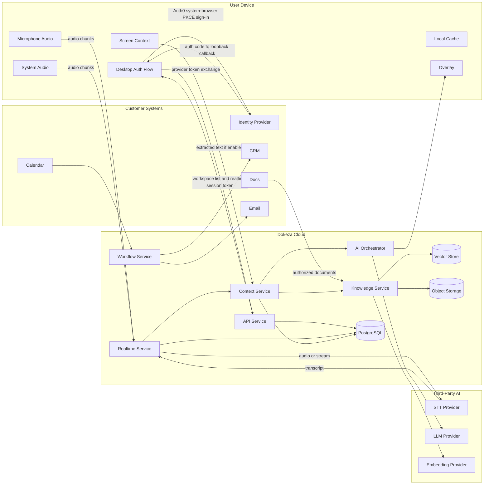

# Dokeza Data Flows and Trust Boundaries

## 1. Purpose

This document maps sensitive Dokeza data across device, cloud, and third-party trust boundaries. It supports engineering design, privacy review, and enterprise security evaluation.

## 2. Trust Boundaries

| Boundary | Description |
| --- | --- |
| User Device | Desktop client, local cache, local audio, screen context, browser extension. |
| Dokeza Cloud | Backend services, storage, retrieval, orchestration, workflows, telemetry. |
| Third-Party AI Providers | STT, embeddings, LLM, reranking providers. |
| Customer Systems | Calendar, email, CRM, ATS, support, docs, identity providers. |
| Billing Provider | Payment and subscription provider. |

## 3. High-Level Flow

For the initial implementation, the desktop does not stream audio directly to STT providers and does not call LLM or embedding providers directly. Cloud AI provider access is mediated by Dokeza backend services so workspace policy, credential isolation, telemetry, and retention controls remain enforceable server-side.

Initial cloud STT implementation:

- The realtime service uses a Deepgram STT adapter for cloud speech-to-text.
- Deepgram credentials are read from server-side configuration only and are never sent to desktop or browser clients.
- The adapter sends raw audio chunks or streams from the realtime service to Deepgram over WebSocket TLS.
- Raw audio is transient in process memory for provider submission and is not written to logs, telemetry, or durable storage by this adapter.
- Adapter telemetry includes provider metadata, chunk timing, stream name, event counts, and failure categories only. It must not include transcript text, raw audio bytes, prompts, documents, suggestions, or API keys.
- Automated tests use a fake provider transport and must not call the live Deepgram service.
- Before an external STT session opens, realtime resolves the authoritative workspace policy and blocks provider submission when `cloud_stt_allowed` is false. Policy lookup failure blocks realtime authentication rather than defaulting to an external call.

Initial hosted auth implementation:

- The selected production-alpha hosted identity provider is Auth0.
- The desktop starts an Auth0 Native Application Authorization Code with PKCE flow in the OS browser.
- Installed builds use the supported Tauri opener plugin from the main window only. Its capability admits HTTPS Auth0 tenant URLs; arbitrary schemes and embedded WebView login are not allowed.
- Build-time desktop security configuration admits only the exact API, realtime, and Auth0 origins. Production generation rejects cleartext or missing hosted endpoints.
- The production-alpha callback is an exact loopback redirect on `127.0.0.1`; desktop accepts it only for a single pending sign-in transaction with validated `state`, `nonce`, PKCE verifier binding, and a short listener lifetime.
- The API service accepts hosted identity provider tokens only at `POST /v1/auth/provider/exchange`.
- The API verifies configured issuer, audience, expiration, RS256 signature, and JWKS key ID through a provider-neutral OIDC/JWKS verifier.
- Hosted provider tokens are not accepted by realtime, meeting review, knowledge, or other resource APIs.
- After verification, the API resolves the provider subject through Dokeza-owned user/workspace membership state and issues a short-lived Dokeza API token.
- The development-only HMAC token issuer remains available only in local/test-enabled environments and is not a production fallback.
- Provider tokens, Dokeza API tokens, realtime tokens, and refresh tokens must not be logged, stored in diagnostics, or emitted in telemetry.

Initial cloud LLM implementation:

- The realtime service routes manual `suggestion.request` messages to the AI orchestrator.
- The AI orchestrator assembles a bounded recent transcript window, optional server-retrieved source chunks labeled as untrusted source material, and a versioned live prompt, then routes generation through an internal model gateway.
- The first production provider path targets OpenAI through the server-side Responses streaming API when `DOKEZA_LLM_PROVIDER=openai`, `OPENAI_API_KEY`, `OPENAI_MODEL`, and workspace policy allow cloud LLM processing.
- An alternative server-side path targets any OpenAI-compatible chat-completions endpoint when `DOKEZA_LLM_PROVIDER=openai_chat`, using `OPENAI_BASE_URL` to select the provider (for example NVIDIA NIM at `https://integrate.api.nvidia.com/v1`, Groq, Together, OpenRouter, or a self-hosted vLLM/Ollama), `OPENAI_MODEL` to select the model, and `OPENAI_API_KEY` for the provider credential. The same bounded transcript, untrusted-source labeling, prompt-versioning, `cloud_llm_allowed` policy gate, and metadata-only telemetry rules apply; only the wire API (`/chat/completions`) and destination host differ. Sending transcript and prompt context to a third-party endpoint is subject to the same workspace policy and provider-DPA expectations as the OpenAI path.
- LLM provider credentials (OpenAI or any OpenAI-compatible endpoint) are read from server-side configuration only and are never sent to desktop or browser clients.
- Realtime advertises `cloud_llm_allowed` in `auth.accepted` and blocks external live suggestion calls when the authenticated workspace policy disables cloud LLM.
- The external-call gate covers both OpenAI Responses and OpenAI-compatible chat endpoints; selecting an alternate base URL does not bypass workspace policy.
- Local and CI tests use deterministic or fake provider transports and must not call the live OpenAI service.
- Adapter telemetry includes provider metadata, route, model, prompt template version, latency, token counts, status, and failure category only. It must not include transcript text, prompt text, retrieved chunk text, generated suggestion content, raw audio bytes, document text, or API keys.
- Completed suggestions from the M2 realtime path are stored as workspace-scoped `suggestions` records when retention policy permits cloud persistence. Persisted suggestions include generated content, prompt/model metadata, request ID, server sequence, and citation metadata for source chunks. `live_only` and `local_only` retention modes keep live suggestions transient and block cloud suggestion persistence.
- Realtime transcript, gap, and suggestion persistence uses the policy resolved for the authenticated workspace connection rather than a process-wide individual retention default.

Initial knowledge-base implementation:

- The API accepts authenticated, workspace-authorized plain-text document uploads for the M3 foundation slice.
- Document text is chunked inside Dokeza Cloud and stored as workspace-scoped `documents` and `document_chunks` records when retention policy permits cloud persistence.
- `live_only` and `local_only` retention modes block cloud document and chunk persistence.
- List responses return document metadata only; authorized detail and search responses can return chunk text and source metadata.
- Search is hybrid keyword plus embedding-backed retrieval in Dokeza Cloud. Local and CI defaults use deterministic credential-free embeddings. Production embedding generation routes through OpenAI when `DOKEZA_EMBEDDING_PROVIDER=openai`, `OPENAI_API_KEY`, configured model settings, and workspace retention policy permit cloud processing.
- OpenAI embedding credentials are read from server-side configuration only and are never sent to desktop or browser clients.
- Upload indexing sends retained document chunks to the embedding provider. Search sends the search query to the embedding provider when semantic retrieval is enabled. Provider failures fall back to keyword-only retrieval.
- Manual live suggestions can request top matching chunks through the realtime service for source-grounded prompt context and citation metadata.
- No reranker, object storage, or third-party knowledge connector data flow is introduced yet.

## 4. Data Flow Table

| Flow | Data | Sensitive Content | Protection | Opt-Out / Policy |
| --- | --- | --- | --- | --- |
| Desktop to Auth0 | Login redirect, PKCE challenge, state, nonce, callback metadata, profile identifiers | Account identity, email, auth metadata | TLS, OS browser, exact redirect allowlist, PKCE, state/nonce validation, short listener lifetime | Required for cloud account usage; local-only future mode may differ |
| Auth0 to desktop | Authorization code through loopback callback, provider tokens after code exchange | Account identity, bearer token | TLS for token exchange, no desktop client secret, platform secure storage for retained tokens, redacted diagnostics | Sign out; revoke provider session |
| Desktop to API auth exchange | Hosted provider token, optional device ID | Account identity, bearer token | TLS, provider token verification, Dokeza-owned membership resolution, metadata-only errors | Sign out; revoke provider session |
| API to desktop | Workspace list, user profile, short-lived realtime token | Account identity, workspace membership, bearer token | TLS, token TTL, platform secure storage, redacted diagnostics | Sign out; revoke sessions |
| API membership administration to PostgreSQL | Actor ID, target user ID, role, account profile metadata; audit action metadata | Account identity and authorization metadata | API authz, transactional owner invariants, restricted DB role, forced RLS for audit rows, no provider token or meeting content | Workspace owner/admin policy; account deletion/export policy |
| API meeting deletion to PostgreSQL | Workspace, meeting ID, actor ID, deletion audit metadata | Meeting identifier and account identity; cascaded rows may contain meeting content | Current durable membership check, creator/owner/admin authorization, restricted DB role, RLS, atomic cascade and metadata-only audit | Authorized user action; workspace retention cleanup |
| Device to realtime service | Audio chunks | Voice, meeting content, PII | TLS, session token, retention policy | Disable capture; local mode where supported |
| Device to context service | Screen text, active window metadata | Visible documents, customer data, secrets | TLS, redaction, permission prompt | Disable screen context |
| Realtime service to STT provider | Audio or audio stream | Voice, meeting content | TLS, provider DPA, Dokeza-managed provider credentials, retention settings | Local STT or provider disabled by policy |
| STT provider to Dokeza | Transcript | Meeting content, PII | TLS, provider retention controls | Local STT |
| Knowledge source to Dokeza | Documents and metadata | Company confidential data | OAuth scopes, TLS, encrypted storage | Connector disabled; document deletion |
| API/AI retrieval from PostgreSQL | Query, actor/role context, document/chunk metadata and text | Company confidential data and query intent | Workspace transaction, forced RLS, creator/owner/admin or exact trusted permission-tag evaluation before list/detail/keyword/vector results | Remove/disable document; group-policy management when implemented |
| Dokeza to embedding provider | Document chunks and search queries | Company confidential data, query intent | TLS, server-side credentials, provider retention controls, metadata-only telemetry, keyword fallback on failure | Local deterministic embeddings or provider disabled |
| AI orchestrator to LLM provider | Prompt, transcript excerpts, retrieved chunks where available | Meeting content, customer data, company data | TLS, server-side credentials, context minimization, provider settings, metadata-only telemetry | Local LLM, provider disabled by policy, or deterministic local/test provider |
| Realtime service to PostgreSQL suggestions | Completed suggestion content, source metadata, prompt/model metadata | Generated meeting assistance, customer context | Workspace-scoped rows, RLS, retention gate, deletion cascade with meeting session, metadata-only errors | Live-only or local-only retention keeps suggestions transient |
| Workflow service to CRM/email | Summaries, drafts, structured updates | Meeting outcomes, customer data | OAuth, TLS, approval workflow | Integration disabled |
| Backend to telemetry | Metrics and errors | Usually non-content | Content redaction, access controls | Debug telemetry disabled by default |

## 5. Data Minimization Rules

- Send only transcript windows needed for the current task.
- Summarize older meeting context before prompt assembly.
- Retrieve only top relevant chunks.
- Revalidate every listed, detailed, keyword, and vector-retrieved chunk against current document permissions. An allowed document ID is an additional restriction, never a permission grant.
- Avoid sending raw screen images to cloud providers unless explicitly enabled.
- Redact known secrets before cloud model calls where technically feasible.
- Do not log prompts or transcripts by default.

## 6. Retention Rules

Default retention options:

- Live-only no-storage mode.
- Local-only draft storage.
- 7-day cloud retention.
- 30-day cloud retention.
- 1-year cloud retention.
- Indefinite retention where explicitly configured.

Initial launch defaults:

- Raw audio is transient by default and is not stored in Dokeza Cloud after STT processing unless a workspace policy explicitly enables storage for a defined purpose.
- Live-only and local-only policies block cloud transcript timeline persistence, including transcript segments and audio gap markers, while allowing live in-session transcript delivery.
- Desktop microphone PCM is transient in CPAL callback buffers, a fixed 32-entry native sample queue, the worker-owned Rubato resampler, and the existing bounded reconnect buffer. It is not written to disk, logs, diagnostics, or telemetry. Overflow drops are represented by metadata-only `audio.gap` messages.
- Individual workspaces default to 7-day cloud retention for transcripts, suggestions, and post-call artifacts.
- Team and business workspaces default to 30-day cloud retention.
- Enterprise workspaces default to 30-day cloud retention until a contract or admin policy sets a stricter or longer period.
- Indefinite retention is never the default; it requires explicit workspace admin configuration.

Retention jobs must delete:

- Meeting sessions.
- Transcript segments.
- Suggestions.
- Post-call artifacts.
- Raw audio, if stored.
- Derived embeddings where source documents are deleted.

## 7. Policy Effects

Workspace policy can disable:

- Screen context.
- Cloud STT.
- Cloud LLM.
- Specific model providers.
- Specific integrations.
- Prompt/content logging.
- User-managed retention overrides.

## 8. Enterprise Review Checklist

- Data flow diagram provided.
- Subprocessor list provided.
- Retention controls documented.
- Encryption controls documented.
- Access controls documented.
- Model training policy documented.
- Deletion behavior documented.
- Integration scopes documented.
- Incident response contact and process documented.
