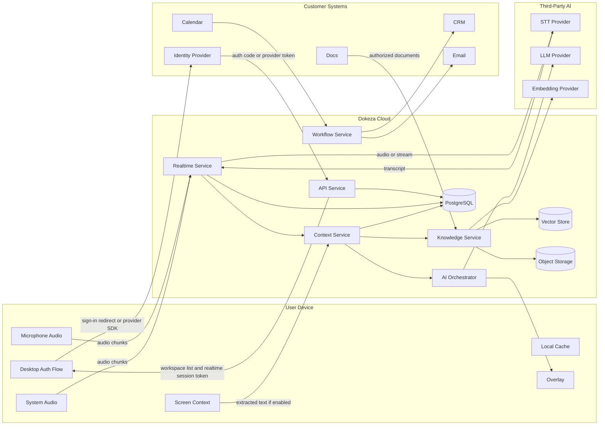

# Dokeza Data Flows and Trust Boundaries

## 1. Purpose

This document maps sensitive Dokeza data across device, cloud, and third-party trust boundaries. It supports engineering design, privacy review, and enterprise security evaluation.

## 2. Trust Boundaries

| Boundary | Description |
| --- | --- |
| User Device | Desktop client, local cache, local audio, screen context, browser extension. |
| Dokeza Cloud | Backend services, storage, retrieval, orchestration, workflows, telemetry. |
| Third-Party AI Providers | STT, embeddings, LLM, reranking providers. |
| Customer Systems | Calendar, email, CRM, ATS, support, docs, identity providers. |
| Billing Provider | Payment and subscription provider. |

## 3. High-Level Flow

For the initial implementation, the desktop does not stream audio directly to STT providers and does not call LLM or embedding providers directly. Cloud AI provider access is mediated by Dokeza backend services so workspace policy, credential isolation, telemetry, and retention controls remain enforceable server-side.

Initial cloud STT implementation:

- The realtime service uses a Deepgram STT adapter for cloud speech-to-text.
- Deepgram credentials are read from server-side configuration only and are never sent to desktop or browser clients.
- The adapter sends raw audio chunks or streams from the realtime service to Deepgram over WebSocket TLS.
- Raw audio is transient in process memory for provider submission and is not written to logs, telemetry, or durable storage by this adapter.
- Adapter telemetry includes provider metadata, chunk timing, stream name, event counts, and failure categories only. It must not include transcript text, raw audio bytes, prompts, documents, suggestions, or API keys.
- Automated tests use a fake provider transport and must not call the live Deepgram service.

Initial cloud LLM implementation:

- The realtime service routes manual `suggestion.request` messages to the AI orchestrator.
- The AI orchestrator assembles a bounded recent transcript window and a versioned live prompt, then routes generation through an internal model gateway.
- The first production provider path targets OpenAI through the server-side Responses streaming API when `DOKEZA_LLM_PROVIDER=openai`, `OPENAI_API_KEY`, `OPENAI_MODEL`, and workspace policy allow cloud LLM processing.
- OpenAI credentials are read from server-side configuration only and are never sent to desktop or browser clients.
- Realtime advertises `cloud_llm_allowed` in `auth.accepted` and blocks external live suggestion calls when the authenticated workspace policy disables cloud LLM.
- Local and CI tests use deterministic or fake provider transports and must not call the live OpenAI service.
- Adapter telemetry includes provider metadata, route, model, prompt template version, latency, token counts, status, and failure category only. It must not include transcript text, prompt text, generated suggestion content, raw audio bytes, document text, or API keys.
- Suggestions from the M2 realtime path are transient unless a later governed persistence slice adds durable suggestion storage, retention, deletion, and export behavior.

Initial knowledge-base implementation:

- The API accepts authenticated, workspace-authorized plain-text document uploads for the M3 foundation slice.
- Document text is chunked inside Dokeza Cloud and stored as workspace-scoped `documents` and `document_chunks` records when retention policy permits cloud persistence.
- `live_only` and `local_only` retention modes block cloud document and chunk persistence.
- List responses return document metadata only; authorized detail and search responses can return chunk text and source metadata.
- Search is deterministic keyword retrieval in Dokeza Cloud for this slice. No embedding provider, reranker, object storage, or third-party knowledge provider data flow is introduced yet.

## 4. Data Flow Table

| Flow | Data | Sensitive Content | Protection | Opt-Out / Policy |
| --- | --- | --- | --- | --- |
| Desktop/API to identity provider | Login redirects, provider tokens, profile identifiers | Account identity, email, auth metadata | TLS, hosted IdP controls, short-lived tokens, secure local token storage | Required for cloud account usage; local-only future mode may differ |
| API to desktop | Workspace list, user profile, short-lived realtime token | Account identity, workspace membership, bearer token | TLS, token TTL, platform secure storage, redacted diagnostics | Sign out; revoke sessions |
| Device to realtime service | Audio chunks | Voice, meeting content, PII | TLS, session token, retention policy | Disable capture; local mode where supported |
| Device to context service | Screen text, active window metadata | Visible documents, customer data, secrets | TLS, redaction, permission prompt | Disable screen context |
| Realtime service to STT provider | Audio or audio stream | Voice, meeting content | TLS, provider DPA, Dokeza-managed provider credentials, retention settings | Local STT or provider disabled by policy |
| STT provider to Dokeza | Transcript | Meeting content, PII | TLS, provider retention controls | Local STT |
| Knowledge source to Dokeza | Documents and metadata | Company confidential data | OAuth scopes, TLS, encrypted storage | Connector disabled; document deletion |
| Dokeza to embedding provider | Document chunks | Company confidential data | TLS, provider retention controls | Local embeddings or provider disabled |
| AI orchestrator to LLM provider | Prompt, transcript excerpts, retrieved chunks where available | Meeting content, customer data, company data | TLS, server-side credentials, context minimization, provider settings, metadata-only telemetry | Local LLM, provider disabled by policy, or deterministic local/test provider |
| Workflow service to CRM/email | Summaries, drafts, structured updates | Meeting outcomes, customer data | OAuth, TLS, approval workflow | Integration disabled |
| Backend to telemetry | Metrics and errors | Usually non-content | Content redaction, access controls | Debug telemetry disabled by default |

## 5. Data Minimization Rules

- Send only transcript windows needed for the current task.
- Summarize older meeting context before prompt assembly.
- Retrieve only top relevant chunks.
- Revalidate retrieved chunks against permissions.
- Avoid sending raw screen images to cloud providers unless explicitly enabled.
- Redact known secrets before cloud model calls where technically feasible.
- Do not log prompts or transcripts by default.

## 6. Retention Rules

Default retention options:

- Live-only no-storage mode.
- Local-only draft storage.
- 7-day cloud retention.
- 30-day cloud retention.
- 1-year cloud retention.
- Indefinite retention where explicitly configured.

Initial launch defaults:

- Raw audio is transient by default and is not stored in Dokeza Cloud after STT processing unless a workspace policy explicitly enables storage for a defined purpose.
- Live-only and local-only policies block cloud transcript timeline persistence, including transcript segments and audio gap markers, while allowing live in-session transcript delivery.
- Individual workspaces default to 7-day cloud retention for transcripts, suggestions, and post-call artifacts.
- Team and business workspaces default to 30-day cloud retention.
- Enterprise workspaces default to 30-day cloud retention until a contract or admin policy sets a stricter or longer period.
- Indefinite retention is never the default; it requires explicit workspace admin configuration.

Retention jobs must delete:

- Meeting sessions.
- Transcript segments.
- Suggestions.
- Post-call artifacts.
- Raw audio, if stored.
- Derived embeddings where source documents are deleted.

## 7. Policy Effects

Workspace policy can disable:

- Screen context.
- Cloud STT.
- Cloud LLM.
- Specific model providers.
- Specific integrations.
- Prompt/content logging.
- User-managed retention overrides.

## 8. Enterprise Review Checklist

- Data flow diagram provided.
- Subprocessor list provided.
- Retention controls documented.
- Encryption controls documented.
- Access controls documented.
- Model training policy documented.
- Deletion behavior documented.
- Integration scopes documented.
- Incident response contact and process documented.
