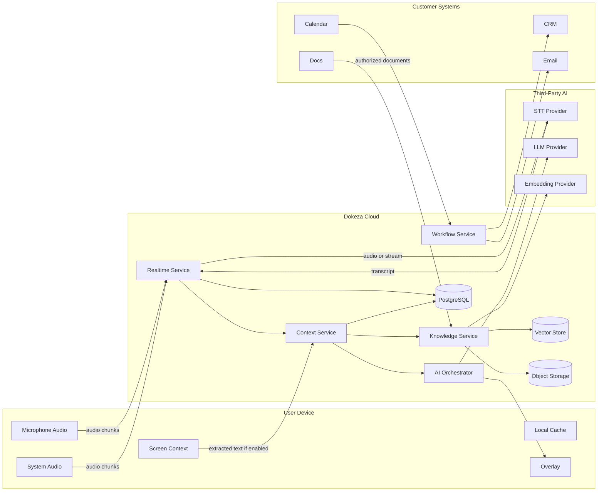

# Dokeza Data Flows and Trust Boundaries

## 1. Purpose

This document maps sensitive Dokeza data across device, cloud, and third-party trust boundaries. It supports engineering design, privacy review, and enterprise security evaluation.

## 2. Trust Boundaries

| Boundary | Description |
| --- | --- |
| User Device | Desktop client, local cache, local audio, screen context, browser extension. |
| Dokeza Cloud | Backend services, storage, retrieval, orchestration, workflows, telemetry. |
| Third-Party AI Providers | STT, embeddings, LLM, reranking providers. |
| Customer Systems | Calendar, email, CRM, ATS, support, docs, identity providers. |
| Billing Provider | Payment and subscription provider. |

## 3. High-Level Flow

## 4. Data Flow Table

| Flow | Data | Sensitive Content | Protection | Opt-Out / Policy |
| --- | --- | --- | --- | --- |
| Device to realtime service | Audio chunks | Voice, meeting content, PII | TLS, session token, retention policy | Disable capture; local mode where supported |
| Device to context service | Screen text, active window metadata | Visible documents, customer data, secrets | TLS, redaction, permission prompt | Disable screen context |
| Realtime service to STT provider | Audio or audio stream | Voice, meeting content | TLS, provider DPA, retention settings | Local STT or provider disabled by policy |
| STT provider to Dokeza | Transcript | Meeting content, PII | TLS, provider retention controls | Local STT |
| Knowledge source to Dokeza | Documents and metadata | Company confidential data | OAuth scopes, TLS, encrypted storage | Connector disabled; document deletion |
| Dokeza to embedding provider | Document chunks | Company confidential data | TLS, provider retention controls | Local embeddings or provider disabled |
| Context service to LLM provider | Prompt, transcript excerpts, retrieved chunks | Meeting content, customer data, company data | TLS, context minimization, provider settings | Local LLM or provider disabled |
| Workflow service to CRM/email | Summaries, drafts, structured updates | Meeting outcomes, customer data | OAuth, TLS, approval workflow | Integration disabled |
| Backend to telemetry | Metrics and errors | Usually non-content | Content redaction, access controls | Debug telemetry disabled by default |

## 5. Data Minimization Rules

- Send only transcript windows needed for the current task.
- Summarize older meeting context before prompt assembly.
- Retrieve only top relevant chunks.
- Revalidate retrieved chunks against permissions.
- Avoid sending raw screen images to cloud providers unless explicitly enabled.
- Redact known secrets before cloud model calls where technically feasible.
- Do not log prompts or transcripts by default.

## 6. Retention Rules

Default retention options:

- Live-only no-storage mode.
- Local-only draft storage.
- 7-day cloud retention.
- 30-day cloud retention.
- 1-year cloud retention.
- Indefinite retention where explicitly configured.

Retention jobs must delete:

- Meeting sessions.
- Transcript segments.
- Suggestions.
- Post-call artifacts.
- Raw audio, if stored.
- Derived embeddings where source documents are deleted.

## 7. Policy Effects

Workspace policy can disable:

- Screen context.
- Cloud STT.
- Cloud LLM.
- Specific model providers.
- Specific integrations.
- Prompt/content logging.
- User-managed retention overrides.

## 8. Enterprise Review Checklist

- Data flow diagram provided.
- Subprocessor list provided.
- Retention controls documented.
- Encryption controls documented.
- Access controls documented.
- Model training policy documented.
- Deletion behavior documented.
- Integration scopes documented.
- Incident response contact and process documented.

