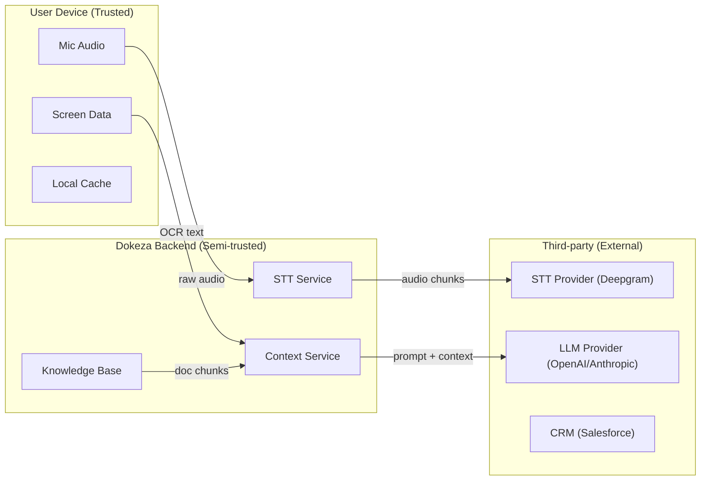

# Dokeza SRS Review — System Design & Engineering Improvements

This review covers [realtime_meeting_copilot_srs.md](file:///c:/Dev/dokeza/docs/srs/realtime_meeting_copilot_srs.md) and [dokeza_full_system_scope.md](file:///c:/Dev/dokeza/docs/srs/dokeza_full_system_scope.md), plus the two engineering reference docs.

---

## Executive Summary

Both documents are **well above average** for early-stage product specs. The SRS has clean requirement IDs, MoSCoW priorities, a latency budget, and good privacy guardrails. The full scope doc is unusually mature — it has verifiable deliverables per milestone, exit gates, a team model, and a cross-milestone delivery matrix.

That said, there are **12 areas where the system design and engineering rigor should be strengthened** before these docs can drive real implementation without ambiguity. Most of the gaps are in the space between "what the product does" and "how the system is actually built."

---

## 1. No Formal Architecture Diagrams (C4 or Similar)

**Where it hurts:** Both documents have ASCII box diagrams showing a linear pipeline (capture → STT → context → LLM → output). This works as a mental model, but it's insufficient for engineering.

**What's missing:**
- **System Context Diagram** — What are the external systems Dokeza talks to? (STT providers, LLM providers, CRM APIs, calendar APIs, auth providers, billing providers, browser extensions). These are all mentioned in prose but never shown as a boundary diagram.
- **Container Diagram** — What are the deployable units? The SRS says "desktop client" and "cloud services" but never defines whether the backend is a monolith, a set of microservices, or serverless functions. This matters enormously for the realtime pipeline.
- **Component Diagram** — Within the desktop client, what are the process boundaries? The audio capture, VAD, STT, context manager, and overlay are listed as layers, but it's unclear which run in the main process, which are sidecar processes, which are web workers, and which are native threads.

**Recommendation:** Add a C4 model (or equivalent) at three levels — System Context, Container, and Component. This will force decisions about:
- Where the WebSocket connection terminates
- Whether STT happens on-device or server-side (and the switchover logic)
- Where the knowledge base lives relative to the LLM orchestrator
- How the desktop client authenticates to each backend service

---

## 2. No API Contract Definitions

**Where it hurts:** The SRS defines functional requirements like "the system shall stream partial transcript results to the context manager" (FR-061) but never specifies the protocol, message format, or contract.

**What's missing:**
- **Desktop ↔ Backend protocol spec** — Is this a single persistent WebSocket? Multiple connections? gRPC streaming? The choice has massive implications for latency, reconnection, and multiplexing.
- **Message schemas** — What does a transcript segment look like on the wire? What does a suggestion response look like? What does a session lifecycle event look like?
- **API versioning strategy** — The desktop client and backend will evolve at different cadences. There's no mention of how breaking changes are handled.

**Recommendation:** Add an `API Contracts` section (or a separate doc) defining:
```yaml
# Example: Realtime session protocol
transport: WebSocket (wss://)
encoding: JSON (consider MessagePack for audio chunks)
messages:
  - session.start
  - audio.chunk (binary frame)
  - transcript.partial
  - transcript.final  
  - suggestion.request
  - suggestion.stream_token
  - suggestion.complete
  - session.end
```

Even at SRS level, specifying **transport + message types** prevents the desktop and backend teams from building incompatible assumptions.

---

## 3. Missing Failure Mode Analysis

**Where it hurts:** Both documents mention graceful degradation in passing (NFR-020, NFR-021, REL-003) but never systematically enumerate failure modes.

**What's missing — a Failure Mode Matrix:**

| Component | Failure Mode | User Impact | Required Behavior |
|-----------|-------------|-------------|-------------------|
| STT provider | 503/timeout | No new transcript | Buffer audio locally, retry, show "transcription paused" indicator, resume when available |
| LLM provider | 503/timeout | No new suggestions | Show stale suggestion with "offline" badge, queue manual requests for retry |
| WebSocket | Connection drop | Everything stops | Auto-reconnect with exponential backoff, resume session from last known state |
| Microphone | Device unplugged | No audio | Detect device change event, pause capture, prompt user to select new device |
| System audio | Loopback unavailable (macOS) | Missing remote speaker transcript | Show clear setup guidance, degrade to mic-only mode |
| Screen capture | Permission revoked mid-session | No screen context | Continue without screen context, hide screen-dependent suggestions |
| Knowledge retrieval | Timeout/error | Generic (non-grounded) answers | Fall back to transcript-only context, flag answer as "not source-grounded" |
| Local storage | Disk full | Can't persist session | Warn user, continue in-memory, skip non-critical writes |

**Recommendation:** Add a dedicated `Failure Modes and Recovery` section. For each subsystem, define: detection method, user-visible indicator, recovery action, and data loss implications.

---

## 4. No Data Flow Privacy Annotations

**Where it hurts:** The SRS correctly identifies sensitive data types (§6.3) and says "avoid sending unnecessary sensitive context to external services" (FR-146). But there's no systematic mapping of **which data crosses which trust boundary**.

**What's missing:**



For every arrow, the spec should answer:
- What PII or sensitive content can this data contain?
- Is it encrypted beyond TLS?
- Is it logged? For how long?
- Can the customer opt out of this specific data flow?
- Does this flow change under different workspace policies?

**Recommendation:** Add a Data Flow Diagram with trust boundary annotations. This is table-stakes for enterprise security reviews (which the scope doc explicitly targets at Milestone 7).

---

## 5. Underspecified Local-First Architecture

**Where it hurts:** Both docs mention local STT and local processing as future capabilities (FR-066, Milestone 9). But the architecture is designed cloud-first with no clear abstraction boundary for local execution.

**The problem:** If you design the system assuming cloud STT and cloud LLM, retrofitting local execution later is extremely painful. The context manager, prompt assembly, and suggestion pipeline all need to work with different latency profiles, different model capabilities, and different error modes.

**What's missing:**
- A **processing location abstraction** — every pipeline stage (STT, embeddings, retrieval, LLM) should have a `ProcessingLocation` config: `cloud | local | hybrid`.
- **Model capability negotiation** — local Whisper small vs. cloud Deepgram have very different accuracy. Local Llama 3 8B vs. cloud GPT-4o have very different reasoning ability. The prompt templates and suggestion quality expectations need to adapt.
- **Hardware requirements for local mode** — If you promise local STT, what's the minimum GPU? What's the RAM requirement? This affects the OS requirements table (§2.4) which currently only lists OS versions.

**Recommendation:** Define the `ProcessingLocation` abstraction now, even if Milestone 9 is far away. At minimum:
```typescript
interface PipelineStageConfig {
  stage: 'stt' | 'embeddings' | 'retrieval' | 'llm';
  location: 'cloud' | 'local' | 'hybrid';
  cloudProvider?: string;
  localModel?: string;
  fallbackLocation?: 'cloud' | 'local';
}
```

---

## 6. No Multi-Tenancy / Workspace Isolation Design

**Where it hurts:** The scope doc defines workspaces, roles, and policies (§7.7) but never specifies the isolation model.

**Key unanswered questions:**
- **Database isolation** — Are workspaces isolated by row-level security (RLS), separate schemas, or separate databases? This affects query performance, data residency, and accidental cross-tenant leakage.
- **Vector store isolation** — Knowledge base embeddings are per-workspace. Are they in the same vector index with a workspace filter, or separate indices? A shared index with a missing filter = data leak.
- **LLM context isolation** — If prompts include workspace-specific instructions and documents, how do you prevent a malicious or buggy prompt from including another workspace's data?
- **Credential isolation** — Integration tokens (Salesforce, HubSpot, Google Calendar) are per-workspace. Where are they stored, and how is cross-workspace access prevented?

**Recommendation:** Add a `Multi-Tenancy Model` section specifying:
- Row-level security for PostgreSQL with `workspace_id` on every table
- Namespace isolation for vector indices (separate collection per workspace, or metadata-filtered with authz enforcement)
- Integration credential storage in a secrets manager (not the primary DB)
- Authz middleware that validates workspace membership on every request

---

## 7. No WebSocket / Streaming Protocol Specification

**Where it hurts:** The latency budget (§3.3) depends entirely on the realtime transport, but there's no protocol design.

**What's missing:**
- **Connection lifecycle** — When does the WebSocket connect? On app start? On session start? Does it stay open between sessions?
- **Reconnection strategy** — What happens during a network blip? Does the client buffer audio and replay, or drop that audio? How does the server know the client reconnected vs. started a new session?
- **Multiplexing** — Is there one WebSocket carrying audio, transcript, suggestions, and session events? Or separate connections per stream? A single multiplexed connection is simpler but requires a message framing protocol.
- **Backpressure** — If the client sends audio faster than the server can process, what happens? If the LLM is slow, does the WebSocket buffer suggestions?
- **Binary vs. text frames** — Audio chunks should be binary frames; transcript/suggestion messages should be JSON text frames. This needs to be specified.

**Recommendation:** Define a lightweight protocol spec:
```
CONNECTION:
  - Client opens WSS connection on session.start
  - Server authenticates via token in first message
  - Heartbeat every 30s; timeout at 90s

FRAMING:
  - Binary frames: audio chunks (PCM 16kHz mono, 100ms chunks)
  - Text frames: JSON messages with { type, payload, seq }

RECONNECTION:
  - Client retries with exponential backoff (1s, 2s, 4s, max 30s)
  - Client sends last_seq on reconnect
  - Server replays missed transcript/suggestion messages
```

---

## 8. Missing Desktop Update and Rollback Strategy

**Where it hurts:** FR-007 says "the system shall support automatic updates" and the scope doc mentions crash reporting and auto-update rollback (§13.2), but there's no design.

**What's missing:**
- **Update channels** — Stable, beta, canary? Enterprise customers will want to pin versions.
- **Differential updates** — Full app re-download vs. delta updates? Tauri supports delta updates natively; Electron doesn't by default.
- **Rollback mechanism** — If an update breaks audio capture on Windows, how do users get back to the previous version? Is this automatic (crash-triggered) or manual?
- **Update-during-meeting protection** — The app must NEVER auto-update during an active meeting session. This needs to be an explicit requirement.
- **Mandatory vs. optional updates** — Security patches may need to be mandatory. Feature updates should be deferrable.

**Recommendation:** Add requirements:
```
FR-007a: The system shall not apply updates during an active meeting session.
FR-007b: The system shall support rollback to the previous version if a critical error is detected after update.
FR-007c: The system shall support update channels (stable, beta) for enterprise deployment.
```

---

## 9. No Offline or Degraded-Mode Design

**Where it hurts:** NFR-020 says "gracefully recover from temporary network interruptions" and NFR-021 says "preserve local meeting state during backend outages." But there's no design for what the degraded experience looks like.

**Scenarios to specify:**

| Scenario | Audio Capture | Transcript | Suggestions | Post-Call |
|----------|:---:|:---:|:---:|:---:|
| Full connectivity | ✅ | ✅ cloud STT | ✅ cloud LLM | ✅ |
| Intermittent network | ✅ | ⚠️ buffered, delayed | ⚠️ queued, delayed | ✅ (retry) |
| No network (local STT) | ✅ | ✅ local STT | ❌ (no LLM) | ⏳ queued for reconnect |
| No network (no local STT) | ✅ (recording only) | ❌ | ❌ | ⏳ queued |
| Backend outage, network OK | ✅ | ⚠️ depends on STT path | ❌ | ⏳ queued |

**Recommendation:** Define a `System Mode` state machine:
```
FULL → DEGRADED_NETWORK → OFFLINE → RECONNECTING → FULL
```
With clear user-visible indicators and feature availability per mode.

---

## 10. Missing Cost Model and Token Budget Design

**Where it hurts:** Both docs mention cost control (FR-169, Risk Register) but never quantify it.

**What's missing:**
- **Per-meeting cost model** — Break down: STT cost + LLM input tokens + LLM output tokens + embeddings queries + storage.
- **Token budget per suggestion** — If you allow 4K tokens of context per suggestion and 30 suggestions per meeting, that's 120K input tokens per meeting. At GPT-4o rates, that's ~$0.30/meeting. At 100 meetings/day across a team, that's $30/day = $900/month.
- **Cost-capping strategy** — The SRS says "debounce" but doesn't specify: max suggestions per minute? Max tokens per session? What happens when a user hits the limit?
- **Margin analysis** — If an individual plan costs $30/month, and heavy users cost $15-30/month in API fees, the unit economics are broken.

**Recommendation:** Add a `Cost Architecture` section:
```
Per-meeting cost target: < $0.10 (individual), < $0.20 (business)

Controls:
- Debounce: max 6 LLM calls/minute
- Context compression: summarize transcript > 5min old
- Model routing: use Haiku/mini for live, Sonnet/4o for post-call
- Retrieval caching: cache embedding queries for repeated questions
- Token budget: max 2K input tokens per live suggestion, max 8K for post-call
```

---

## 11. Missing Threat Model

**Where it hurts:** The SRS has a good security section (§5.3) and the scope doc targets SOC 2 readiness (§10, future enhancement). But there's no structured threat model.

**Key threats to enumerate:**

| Threat | Vector | Impact | Mitigation |
|--------|--------|--------|------------|
| Prompt injection via transcript | Attacker speaks crafted text in meeting | LLM follows injected instructions, leaks KB data | Input sanitization, output validation, prompt hardening |
| Knowledge base data exfiltration | Malicious document with prompt injection | LLM returns sensitive KB content to unauthorized user | Permission-aware retrieval, output filtering, source-access validation |
| Cross-workspace data leakage | Missing workspace filter on retrieval query | User sees another workspace's documents | RLS, authz middleware, integration tests |
| Desktop credential theft | Malware on user's machine | OAuth tokens, API keys stolen | Platform keychain (Credential Manager / Keychain), token rotation |
| Man-in-the-middle on audio stream | Network interception | Meeting audio leaked | Certificate pinning, mutual TLS |
| Insider access to transcripts | Backend engineer queries production DB | Privacy violation | Encryption at rest with customer-managed keys, access audit logs |

**Recommendation:** Create a `docs/security/threat_model.md` using STRIDE or similar framework. Reference it from both SRS documents.

---

## 12. SRS-to-Scope Traceability Gaps

**Where it hurts:** The SRS has requirement IDs (FR-001 through FR-283, NFR-001 through NFR-104). The scope doc has milestones and deliverables. But there's no mapping between them.

**What's missing:**
- Which SRS requirements are satisfied by which milestone?
- Which requirements are MVP (Milestone 1-4) vs. post-MVP?
- Are any SRS requirements orphaned (not covered by any milestone)?
- Are any scope deliverables not backed by an SRS requirement?

**Example gap I found:** The scope doc introduces **pre-call briefs** as a core capability across all verticals (§6.1-6.6) and Milestone 4, but the SRS only has a single `Should` requirement for it (FR-242: "The system shall use calendar events to generate pre-call briefs"). Given how central pre-call briefs are to the scope doc's product thesis ("help before, during, and after the call"), this should be a `Must` with sub-requirements.

**Another gap:** The scope doc has **browser extension context** (§7.3) as a full platform vertical with deliverables and verification criteria. The SRS mentions it once as a `Could` (FR-086) and lists it as an MVP exclusion. These docs disagree on priority.

**Recommendation:** Add a traceability matrix:
```
| Scope Deliverable | SRS Requirement(s) | Priority Alignment? |
|---|---|---|
| Pre-call brief | FR-242 (Should) | ⚠️ Scope treats as core, SRS treats as Should |
| Browser extension | FR-086 (Could) | ⚠️ Scope has full vertical, SRS excludes from MVP |
| CRM writeback | FR-226, FR-243, FR-244 (Should) | ✅ Both treat as post-MVP |
```

---

## Summary of Recommended New Sections / Documents

| Document | Status | Priority |
|----------|--------|----------|
| C4 Architecture Diagrams | **Missing** | 🔴 High — blocks engineering |
| API Contracts / Protocol Spec | **Missing** | 🔴 High — blocks desktop + backend parallelism |
| Failure Mode Matrix | **Missing** | 🔴 High — blocks reliability design |
| Data Flow with Trust Boundaries | **Missing** | 🔴 High — blocks security review |
| Multi-Tenancy Isolation Model | **Missing** | 🔴 High — blocks data model |
| Processing Location Abstraction | **Missing** | 🟡 Medium — can retrofit but expensive |
| Desktop Update Strategy | **Underspecified** | 🟡 Medium — needed before beta |
| Degraded Mode State Machine | **Missing** | 🟡 Medium — needed before beta |
| Cost Model / Token Budgets | **Missing** | 🟡 Medium — needed before pricing |
| Threat Model (STRIDE) | **Missing** | 🔴 High — scope doc targets enterprise |
| SRS ↔ Scope Traceability Matrix | **Missing** | 🟡 Medium — prevents spec drift |
| WebSocket Protocol Spec | **Missing** | 🔴 High — blocks realtime implementation |

---

## What's Already Good

To be clear — these docs are strong starting points:

- ✅ **Clean requirement IDs** with MoSCoW priorities (SRS)
- ✅ **Latency budgets** broken down by pipeline stage (SRS §3.3)
- ✅ **Verifiable deliverables and exit gates** per milestone (Scope)
- ✅ **Explicit ethical boundaries** — "shall not be designed for evasion" (both docs)
- ✅ **Cross-milestone delivery matrix** showing vertical vs. milestone dependencies (Scope §9)
- ✅ **Team model and squad ownership** (Scope §11)
- ✅ **Risk register** with mitigations (both docs)
- ✅ **Testing strategy** covering automated, manual, and AI evaluation (Scope §12)
- ✅ **Commercial gates** — "don't launch enterprise until SSO, SCIM, audit logs work" (Scope §14.2)
- ✅ **Data retention granularity** — no-storage, local-only, configurable cloud retention (SRS §6.2)

The foundation is solid. The improvements above are about closing the gap between "product spec" and "engineering spec" so that developers can build without ambiguity.
